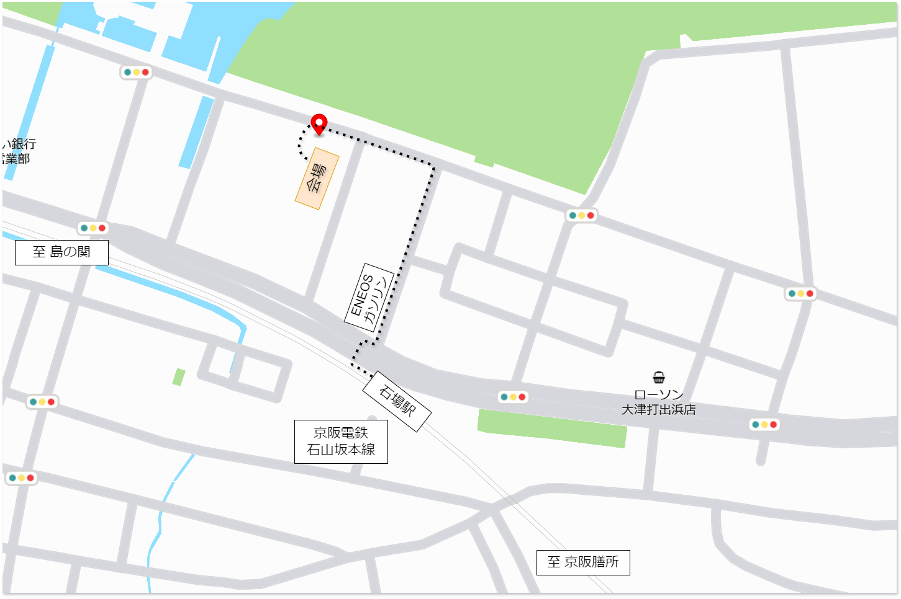
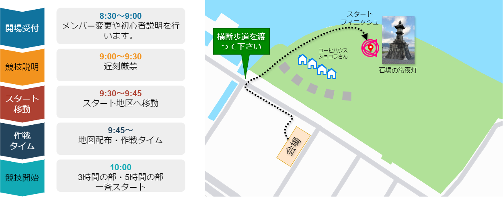

# プログラム

## 会場

大津市勤労福祉センター 4階 研修室1, 研修室2
  : [520-0806 大津市打出浜1番6号](https://maps.app.goo.gl/Wr61vGMbTDrzbFvj9)

### アクセス

公共交通機関にてお越しの方
  : [京阪電車石山坂本線「石場駅」より徒歩5分](https://maps.app.goo.gl/mY9FLW4ChimJW3s96)
  : {align=center w=700px}

お車でお越しの方
  : 近隣の有料駐車場をご利用ください。
  : ```{warning}

    会場の大津市勤労福祉センターの駐車場は **利用できません**。 
    ```

## 持ち物

必携品
    : * 時計
      * 携帯電話
      * デジタルカメラ（携帯電話でも可）

当日配布物
    : * 地図
      * チェックポイント一覧表
      * 地図ビニール袋
      * ゼッケン・安全ピン（チームごと）
    　* 参加賞

任意携行品
    : * コンパス（貸出品：貸出時には保証金として2,000円をお預かりいたします）
      * 水
      * 補給食
      * 雨具
      * お金
      * 不整地を走ることができるシューズ、モバイルバッテリー

## 当日のながれ

### 受付～スタート

{align=center width=800px}

受付
  : * メンバー変更がある場合は、受付の用紙にてご記入ください。
    * 受付時に、当日連絡の取れる携帯電話番号をご記入ください。
    * ゼッケンの取り付け、着替えなどの時間を見越して余裕を持って受付を済ませてください。

競技説明
  : * 受付終了後、競技説明にご参加ください。
    * 安全管理のため、競技説明に参加されていなチームの出走は禁止します。
    * 競技説明は、本プログラムの説明となります。事前に本プログラムを十分にお読みください。

### 競技中

* 公共交通機関の利用は、コースポイントが設定された京阪電鉄の駅のみ利用可能です。
* 私有地、耕作地、田んぼなどへの進入を固く禁止します。
* コース上に有料区間がある場合の進入は妨げません。あらかじめ通行料を持参の上出走してください。またこの際、所有者の指示に従い他の通行者の妨げとならないよう十分注意してください。
* チェックポイント一覧表の写真と同じショットで撮影者以外チームメンバー全員が写るように撮影してください。

### フィニッシュ

撮影者以外の全員と、フィニッシュに設置してある時計の時刻が判別できるように写真を撮ってください。

### スコアシートの記入

フィニッシュが済みましたら会場にお戻りください。スタート移動の逆ルートで **横断歩道を通って** 会場へお戻りください。
会場では次のようなスコア計算シートが用意されています。各チーム毎に通過したポイントを順にご記入いただき、ポイントの合計点数を計算してください。

{align=center width=500px}

部門毎の制限時刻、および、フィニッシュで撮影した時刻の減点計算方法は以下のとおりです。

```{csv-table}
:header: 時刻, 内容, 注意事項
:widths: 1,3,6
13:00, 3時間の部制限時間, フィニッシュに写った時刻をフィニッシュ時刻として13:00から1分毎に100点の減点とし、13:30以後は失格となります。
13:30, 3時間の部表彰式, 上位入賞者のコースを公開します。
15:00, 5時間の部制限時間, フィニッシュに写った時刻をフィニッシュ時刻として15:00から1分毎に100点の減点とし、15:30以後は失格となります。
15:30, 5時間の部表彰式, 上位入賞者のコースを公開します。
```

### 写真照合

記入済みのスコアシートとチェックポイントでの撮影済みのカメラをお持ちの上、写真照合受付窓口へお越しください。
結果速報は、以下のサイトからご覧いただけます。

