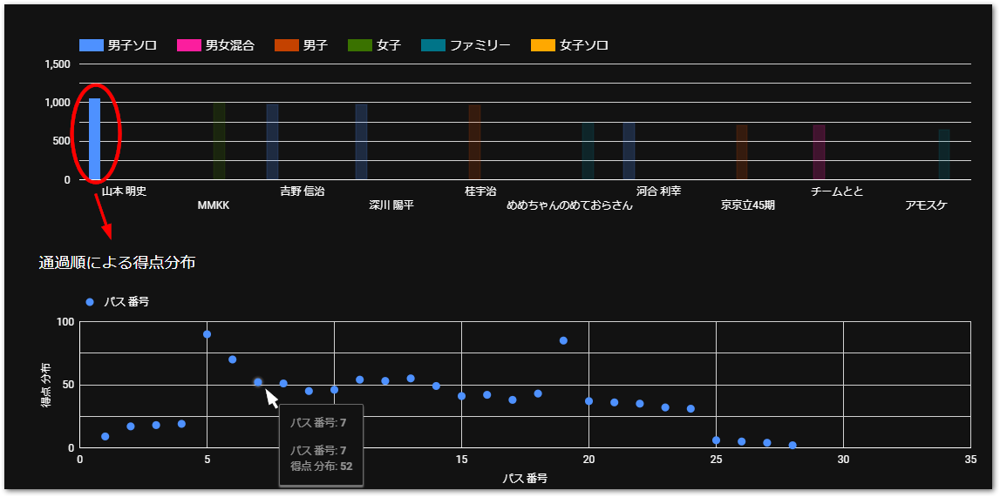

# リザルト

[淡海ロゲイニング2024リザルト](./assets/淡海ロゲイニング2024リザルト.pdf)

## 各チームの取得ポイント詳細データ

3時間の部の結果、5時間の部の結果ページでは、次図のとおりバーグラフで各選手、チームの総合得点が一覧されています。バーの部分をクリック、またはタップすると、その選手の通過順の得点をプロットするグラフを表示します。ドットにカーソルを合わせると、順番と得点がポップアップ表示されます。地図とともにご覧ください。

{align=center}

### 3時間の部

[3時間の部の結果](https://lookerstudio.google.com/s/l7JZqSPLKHA)

{align=center}

### 5時間の部

[5時間の部の結果](https://lookerstudio.google.com/s/tKJ9rUy6ejo)

{align=center}
